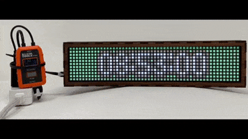
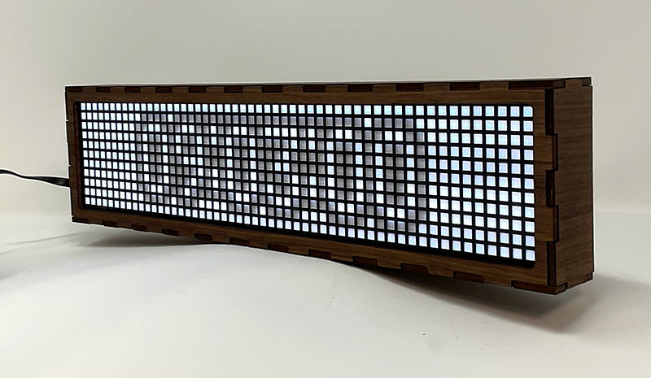
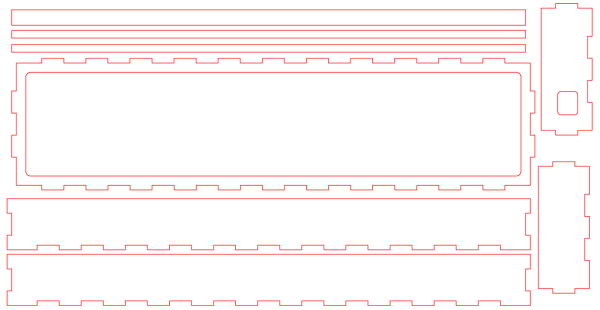
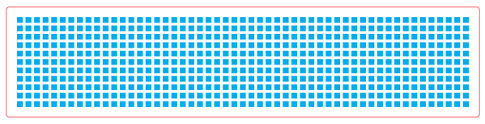

# Cheer Clock v1 November, 2022

The [Pimoroni Galactic Unicorn](https://shop.pimoroni.com/products/galactic-unicorn?variant=40057440960595) is a
fantastic LED reader board! It covers much of your tinkering needs. This code sample allows you to program the
included 
[Raspberry Pi PICO W](https://www.raspberrypi.com/products/raspberry-pi-pico/) to do a couple of
really cool IoT things:
* Create a bright, easy to read, Internet synchronized clock, for your desk or workbench
* Tune into the global "mood ring" that is the [Cheerlights Community](https://cheerlights.com/). Set your clock's
  background color to the same color as thousands of other devices around the world.

## What's in this GitHub repository:
* [MicroPython Code](./MicroPython/) - The source code for the clock shown above.
* [Laser-cut templates](./Case_Template/) - The SVG files for the box-joint case and the acrylic diffuser grill.

## About the Galactic Unicorn case:
There have been several follow up questions about the case and the diffuser. It may actually be the more popular part of this project.  The case was made out of 3mm birch plywood (baltic birch if you can find it). The diffuser is 3mm translucent white acrylic with a matte black paint layer on one side. The laser engraving, identified in blue on the digital files, ablades the paint layer to reveal a clean grid for the Galactic Unicorn LEDs behind.  Both the case and the diffuser files are available in the [Case_Template](./Case_Template) folder of this repository.

